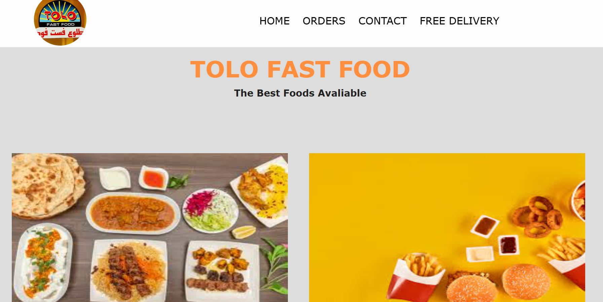

# product-landing-page 🚀

## Project Description 📝

This project is a Product-Landing-Page. about an online offering food,
by design this page a learned more about html and css.
I learned about how to create a responsive web page and how to write a code inside the page that show like a code.

## Demo 📸

live mode (https://faridafaqiri.github.io/product-landing-page/)



## Technologies Used 🛠️

- HTML
- CSS

## Installation 💻

To access this project, you need to follow the steps below.

```bash
git clone git@github.com:faridafaqiri/Technical-documentation-page.git

```

## Usage 🎯

after clone the repository in your local machine you can open the html file in your browser.
to access the code of project you can open it visual studio code editor.

## Author 👩‍💻

You can contact me through the following:

- LinkedIn: (<https://www.linkedin.com/in/farida-faqiri-071a31309/>)
- Email: (<farida.faqiri2@gmail.com>)

## Contributing 🤝

I would be happay if you share any bugs, reports, requests, with me in this project you can share   by pull request and will be marge in my project.
